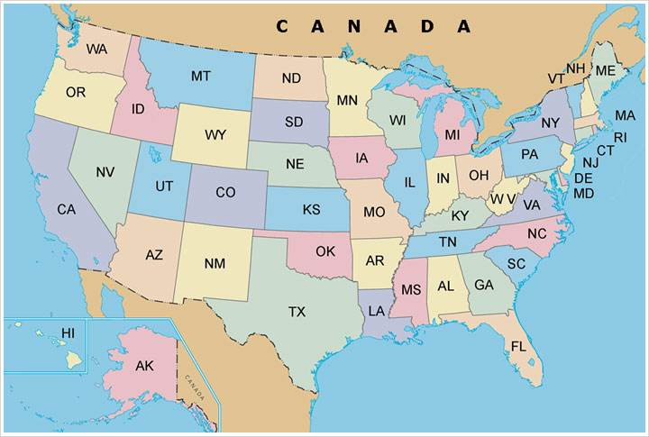
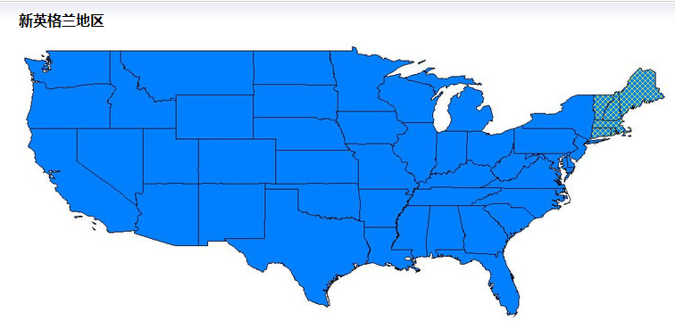

美利坚合众国（United States of America，简称美国）由 50 个州，一个直辖特区（首都所在地华盛顿哥伦比亚特区），5 个岛屿自由邦和十多个其他远洋小岛组成。按照不同的理论，美国本土的48个州可以划分为七大或九大或十大区域。其中最传统的划分方式为：新英格兰，中大西洋地区，东南地区，南方地区，中西部地区，上密西西比-五大湖区，落基山区，太平洋沿岸地区，西南地区。

美国联邦政府（Federal government of the United States）主要包括国会、总统、联邦法院三大机构，依据三权分立与联邦制两大政治思想而制定，将立法、司法、行政三种权力分别独立，互相制衡，以避免政府滥权。

美国国会（Congress）是美国最高立法机构，由参议院（Senate）、众议院（House）两院组成。两院议员由各州选民直接选举产生。参议员每州 2 名，共 100 名，任期 6 年，每两年改选 1/3。众议员按各州的人口比例分配名额选出，共 435 名，任期两年，期满全部改选。两院议员均可连任，任期不限。参众议员均系专职，不得兼任政府职务。

## 美国行政区划

美国每一个州都是一个独立的邦国，有自己的宪法。联邦政府的权力，由各州政府授予。没有授予联邦政府的权力，仍然由各州自行拥有。每个州都有自己的立法、司法、行政体系。州议员和州长都由普选产生。另有印第安保留区和公立大学系统等特殊行政单位。美国人口普查局把全国划分为九大地区，而地理学界常把美国划分为七大地区、九大地区或十大地区。它们并不是真正的行政区划，但是对美国的行政有着一些影响，因此经常被列在行政区划里。其中最传统的美国行政区的划分方式为：新英格兰，中大西洋地区，东南地区，南方地区，中西部地区，上密西西比-五大湖区，落基山区，太平洋沿岸地区，西南地区。

美国行政区划架构为

- 五十个州

  下设县和区，在依都会结构下设市、乡、镇、村及其他基层政区。除了最初的十三个殖民地外，其他各州依据美国国会法案成为美利坚合众国的一部份。

- 哥伦比亚特区

  即为首都华盛顿市，虽然哥伦比亚特区不是一个州，且在众议院仅有一名无投票权的代表，在参议院则无代表，但是特区居民仍能参与投票选举总统，在选举人团中也有投票代表。

- 印第安保留地

  拥有准独立地位，虽然各保留地是所在州的一部分，同样投票选举州长及必须缴交州税，但所在州的法令对各保留地则不完全适用。

- 美国海外领地

- 海外军事基地

- 生态保留区或学区之类的准行政区

美国十个行政区域比较

1. 东海岸（中大西洋）：美国象征。
2. 新英格兰地区：生活乐园。
3. 西海岸（太平洋沿岸）地区：阳光地带。
4. 五大湖周边地区：制造中心。
5. 阿巴拉契亚山地区：南北结合。
6. 东南部地区：热烈海岸。
7. 西南部地区：激情领地。
8. 中央平原地区：天下粮仓。
9. 高山地区：丰富多彩。
10. 大本土以外地区：无与伦比。（夏威夷和阿拉斯加）

经济发达地区一般被认为：1、2、3、4（沿海地区和五大湖区）

教育质量一般被认为的排序：2、3、1、4、5、8、7、6、9、10

毕业就业一般被认为的排序：1、2、3、4、5、9、7、6、8、10

社会治安一般被认为的排序：8、9、2、5、10、7、3、4、6、1

## 人种发布

白人（欧洲后裔）人口密度较大的依次是：新英格兰地区、五大湖周遍地区、阿巴拉契亚山地区、中央平原地区、东海岸（中大西洋）地区。

亚洲人口密度较大的依次是：西海岸（太平洋沿岸）地区、东海岸（中大西洋）地区的纽约、夏威夷。

西班牙语系（包括南美移民）人口密度较大的依次是：东南部地区、西南部地区。

墨西哥人和印地安人人口密度较大的依次是：论西南部地区、西海岸（太平洋沿岸）地区、高山地区。

黑人人口密度较大的依次是：纽约、洛杉矶和芝加哥等大城市、南部沿海（包括东南部地区和西南部地区的沿海部分）。

纽约、洛杉矶是人种最杂乱、最国际多样花的城市！可以说是 “外国人” 的城市！（这些大城市都有华人区和黑人区，有通常所认为的贫民地带）

- 美国 50 州

| 缩写 | State          | 州名         | 首府           |
| ---- | -------------- | ------------ | -------------- |
| AL   | Alabama        | 阿拉巴马州   | 蒙哥马利       |
| AK   | Alaska         | 阿拉斯加州   | 朱诺           |
| AZ   | Arizona        | 亚利桑那州   | 凤凰城         |
| AR   | Arkansas       | 阿肯色州     | 小石城         |
| CA   | California     | 加利福尼亚州 | 萨克拉门托     |
| CO   | Colorado       | 科罗拉多州   | 丹佛           |
| CT   | Connecticut    | 康涅狄格州   | 哈特福德       |
| DE   | Delaware       | 特拉华州     | 多佛           |
| FL   | Florida        | 弗罗里达州   | 塔拉哈西       |
| GA   | Georgia        | 乔治亚州     | 亚特兰大       |
| HI   | Hawaii         | 夏威夷州     | 火奴鲁鲁       |
| ID   | Idaho          | 爱达荷州     | 博伊西         |
| IL   | Illinois       | 伊利诺州     | 斯普林菲尔德   |
| IN   | Indiana        | 印第安纳州   | 印第安纳波利斯 |
| IA   | Iowa           | 爱荷华州     | 得梅因         |
| KS   | Kansas         | 堪萨斯州     | 托皮卡         |
| KY   | Kentucky       | 肯塔基州     | 法兰克福       |
| LA   | Lousiana       | 路易斯安那州 | 巴吞鲁日       |
| ME   | Maine          | 缅因州       | 奥古斯塔       |
| MD   | Maryland       | 马里兰州     | 安纳波利斯     |
| MA   | Massachusetts  | 马萨阻塞州   | 波士顿         |
| MI   | Michigan       | 密歇根州     | 兰辛           |
| MN   | Minnesta       | 明尼苏达州   | 圣保罗         |
| MS   | Mississippi    | 密西西比州   | 杰克逊         |
| MO   | Missouri       | 密苏里州     | 杰弗逊城       |
| MT   | Montana        | 蒙大拿州     | 海伦那         |
| NE   | Nebraska       | 内布拉斯加州 | 林肯           |
| NV   | Nevada         | 内华达州     | 卡森市         |
| NH   | New Hampshire  | 新罕布什尔州 | 康科德         |
| NJ   | New Jersey     | 新泽西州     | 特伦顿         |
| NM   | New Mexico     | 新墨西哥州   | 圣达菲         |
| NY   | New York       | 纽约州       | 奥尔巴尼       |
| NC   | North Carolina | 北卡罗莱纳州 | 罗利           |
| ND   | North Dakota   | 北达科他州   | 俾斯麦         |
| OH   | Ohio           | 俄亥俄州     | 哥伦布         |
| OK   | Oklahoma       | 奥克拉荷马州 | 奥克拉荷马市   |
| OR   | Oregon         | 俄勒冈州     | 塞勒姆         |
| PA   | Pennsylvania   | 宾夕法尼亚州 | 哈里斯堡       |
| RI   | Rhode Island   | 罗德岛州     | 普罗维登斯     |
| SC   | South Carolina | 南卡罗莱纳州 | 哥伦比亚       |
| SD   | South Dakota   | 南达科他州   | 皮尔           |
| TN   | Tennessee      | 田纳西州     | 纳什维尔       |
| TX   | Texas          | 德克萨斯州   | 奥斯汀         |
| UT   | Utah           | 犹他州       | 盐湖城         |
| VT   | Vermont        | 佛蒙特州     | 蒙彼利埃       |
| VA   | Virginia       | 维吉尼亚州   | 里士满         |
| WA   | Washington     | 华盛顿州     | 奥林匹亚       |
| WV   | West Virginia  | 西维吉尼亚州 | 查尔斯顿       |
| WI   | Wisconsin      | 威斯康星州   | 麦迪逊         |
| WY   | Wyoming        | 怀俄明州     | 夏延           |

当然还有华盛顿哥伦比亚特区（Washington D.C.）、一些岛屿地区和一些岛礁。

## 新英格兰区

新英格兰地区（New England）（6 个州）

包括：缅因州、新罕布什尔州、佛蒙特州、罗德岛州、康涅狄格州、马萨阻塞州。

主要城市：波士顿、纽黑文、普罗维登斯、曼切斯特、奥古斯丁。

主要名胜：普利茅斯港、波士顿公园、瓦尔登湖、列克星敦、哈佛大学、麻省理工学院、耶鲁大学。

## 中大西洋地区

中大西洋地区（Middle Atlantic）（7个州、1个特区）

包含州：纽约州、宾夕法尼亚州、新泽西州、特拉华州、马里兰州、弗吉尼亚州、西弗吉尼亚州、华盛顿特区。

主要城市：费城、纽约城、匹兹堡、里士满、巴尔地摩、华盛顿特区、查尔斯顿、布法罗、弗吉尼亚比奇。 

主要名胜：尼亚加拉大瀑布、自由女神、帝国大厦、大都会博物馆、中央公园、华盛顿博物馆群、林肯纪念堂、白宫、阿灵顿山、落水山庄、巴尔地摩港口、詹姆斯顿、蓝山山脉、盖蒂斯堡、普林斯顿大学、独立钟、威廉玛丽学院、弗吉尼亚大学。

## 东南地区

东南地区（Southeast ）（4个州）

包含州：北卡罗来纳州、南卡罗来纳州、佐治亚州、佛罗里达州。

主要城市：夏洛特、亚特兰大、哥伦比亚、萨凡纳、杰克逊维尔、坦帕、迈阿密、奥兰多。

主要名胜：奥兰多迪斯尼、奥兰多环球影城、迈阿密海滩、南卡罗来纳查尔斯顿、坦帕海滩、基韦斯特城、大雾山国家公园。

## 上密西西比河谷地区（五大湖区）

上密西西比河谷地区（五大湖区）Upper Mississippi（Great Lakes）（5个州）

包含州：密歇根州、俄亥俄州、印第安纳州、伊利诺伊州、威斯康星州。

主要城市：底特律、芝加哥、辛辛那提、克利夫兰、哥伦布、密尔沃基、大急流城。

主要名胜：五大湖、画岩国家公园、马奎特国家纪念区、芝加哥市景、芝加哥大学。

## 南方地区

南方地区（South）（6个州）

所含州：肯塔基州、田纳西州、亚拉巴马州、密西西比州、阿肯色州、路易斯安那州。

主要城市：小石城、纳什维尔、孟菲斯、新奥尔良。

主要名胜：纳什维尔音乐城、田纳西河河谷、密西西比三角洲、石河战场、梅尔罗斯纳国家公园。

## 中西部地区（大平原地区）

中西部地区（大平原地区）（Mid-west）（8个州）

所含州：明尼苏达州、爱荷华州、密苏里州、堪萨斯州、俄克拉荷马州、内布拉斯加州、南达科他州、北达科他州。

主要城市：堪萨斯城、明尼阿波利斯、圣路易斯、俄克拉荷马城、林肯、俾斯麦。

 主要名胜：总统头像山、大玉米地、烟斗石国家纪念园、风洞国家公园、刀河印第安村落、阿盖特化石区、圣路易斯大拱门。

## 落基山区

落基山区（Rocky Mountain States）（6个州）

所含州：蒙大拿州、爱达荷州、内华达州、怀俄明州、科罗拉多州、犹他州。

主要城市：盐湖城、拉斯维加斯、雷诺、丹佛。

主要名胜：黄石公园、大提顿国家公园、大盐湖、摩门教圣殿、杰克逊镇、拉斯维加斯市景、落基山国家公园、布莱斯峡谷国家公园、锡安国家公园、拱门国家公园、太浩湖。

## 太平洋海岸区

太平洋海岸区（Pacific Coast）所含州：华盛顿州、俄勒冈州、加利福尼亚州。

主要城市：西雅图、波特兰、旧金山、洛杉矶、圣迭戈。

主要名胜：奥林匹亚山、雷尼尔山、火山口湖国家公园、约赛米蒂国家公园、金门大桥、圣迭戈科罗纳多军港、洛马角、斯坦福大学。

## 西南地区

西南地区（Southwest）所含州：亚利桑那州，新墨西哥州，德克萨斯州。

主要城市：凤凰城，圣菲，达拉斯，休斯顿。

名胜：墨西哥湾，太空城。

## 地理常识

美国有 50 个州（States），是一级行政区；

接下来，美国的二级行政区叫 county （县）；

三级行政区分两种：city（城市）和 town（镇）。

## 人口分布

下图动态展示了美国 1790 - 2010 的人口密度发布变化。 

 